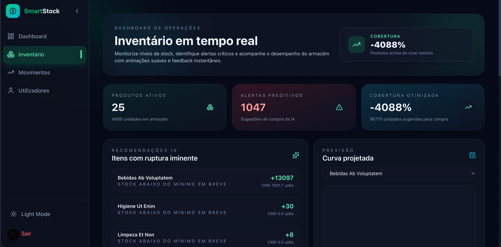
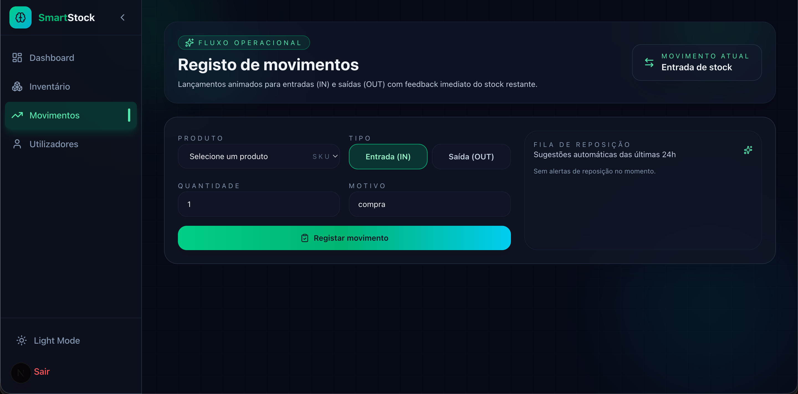
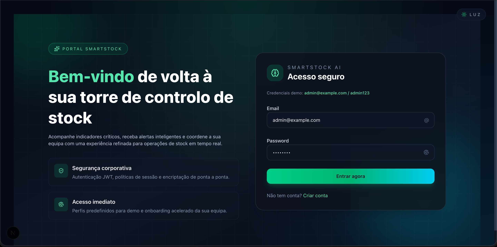

<p align="center"><a href="https://laravel.com" target="_blank"></a></p>

<p align="center">
<a href="https://github.com/laravel/framework/actions"></a>
<a href="https://packagist.org/packages/laravel/framework"></a>
<a href="https://packagist.org/packages/laravel/framework"></a>
<a href="https://packagist.org/packages/laravel/framework"></a>
</p>

## About Laravel

Laravel is a web application framework with expressive, elegant syntax. We believe development must be an enjoyable and creative experience to be truly fulfilling. Laravel takes the pain out of development by easing common tasks used in many web projects, such as:

- [Simple, fast routing engine](https://laravel.com/docs/routing).
- [Powerful dependency injection container](https://laravel.com/docs/container).
- Multiple back-ends for [session](https://laravel.com/docs/session) and [cache](https://laravel.com/docs/cache) storage.
- Expressive, intuitive [database ORM](https://laravel.com/docs/eloquent).
- Database agnostic [schema migrations](https://laravel.com/docs/migrations).
- [Robust background job processing](https://laravel.com/docs/queues).
- [Real-time event broadcasting](https://laravel.com/docs/broadcasting).

Laravel is accessible, powerful, and provides tools required for large, robust applications.

## Learning Laravel

Laravel has the most extensive and thorough [documentation](https://laravel.com/docs) and video tutorial library of all modern web application frameworks, making it a breeze to get started with the framework. You can also check out [Laravel Learn](https://laravel.com/learn), where you will be guided through building a modern Laravel application.

If you don't feel like reading, [Laracasts](https://laracasts.com) can help. Laracasts contains thousands of video tutorials on a range of topics including Laravel, modern PHP, unit testing, and JavaScript. Boost your skills by digging into our comprehensive video library.

## Laravel Sponsors

We would like to extend our thanks to the following sponsors for funding Laravel development. If you are interested in becoming a sponsor, please visit the [Laravel Partners program](https://partners.laravel.com).

### Premium Partners

- **[Vehikl](https://vehikl.com)**
- **[Tighten Co.](https://tighten.co)**
- **[Kirschbaum Development Group](https://kirschbaumdevelopment.com)**
- **[64 Robots](https://64robots.com)**
- **[Curotec](https://www.curotec.com/services/technologies/laravel)**
- **[DevSquad](https://devsquad.com/hire-laravel-developers)**
- **[Redberry](https://redberry.international/laravel-development)**
- **[Active Logic](https://activelogic.com)**

## Contributing

Thank you for considering contributing to the Laravel framework! The contribution guide can be found in the [Laravel documentation](https://laravel.com/docs/contributions).

## Code of Conduct

In order to ensure that the Laravel community is welcoming to all, please review and abide by the [Code of Conduct](https://laravel.com/docs/contributions#code-of-conduct).

## Security Vulnerabilities

If you discover a security vulnerability within Laravel, please send an e-mail to Taylor Otwell via [taylor@laravel.com](mailto:taylor@laravel.com). All security vulnerabilities will be promptly addressed.

## License

The Laravel framework is open-sourced software licensed under the [MIT license](https://opensource.org/licenses/MIT).

# SmartStock AI

Full-stack inventory management with AI. Backend: Laravel 12 (PHP 8.2). Frontend: Next.js 16 (React 19). Docker-first dev environment.

- API (Laravel + PHP-FPM) on http://localhost:8080
- Web (Next.js) on http://localhost:3000
- PgAdmin on http://localhost:5050

Read this in Portuguese: README.pt-BR.md

## Quick start (Docker)

Prerequisites: Docker Desktop 4.24+ and Compose V2.

1) Create environment file for containers (first time only):

```bash
cp .env.docker .env
```

2) Start everything:

```bash
./scripts/docker-up.sh
```

3) Open:
- API: http://localhost:8080
- Frontend: http://localhost:3000
- PgAdmin: http://localhost:5050 (admin@admin.com / admin)

Common maintenance:

```bash
./scripts/migrate.sh          # Run migrations
./scripts/seed.sh             # Seed database
./scripts/clear.sh            # Clear Laravel caches
./scripts/docker-logs.sh      # Tail logs
./scripts/docker-restart.sh   # Restart services
./scripts/docker-down.sh      # Stop and remove containers/volumes
```

## Local (without Docker)

If you prefer running locally:

Backend:
- PHP 8.2+, Composer, SQLite/Postgres
- Commands: `composer install && cp .env.example .env && php artisan key:generate && php artisan migrate --seed && php artisan serve`

Frontend:
- Node.js 20+, pnpm/yarn/npm
- Commands: `cd public/smartstock-frontend && cp .env.local.example .env.local && npm i && npm run dev`

## Configuration

- Laravel uses Postgres in Docker. Defaults:
  - Host: postgres, Port: 5432, DB: smartstock_ai, User: smartuser, Pass: smartpass
- Frontend reads `NEXT_PUBLIC_API_BASE_URL` (defaults to http://localhost:8080)
- CORS/Sanctum are configured for localhost:3000 and 8080 via `.env.docker`

## Project structure

- backend (Laravel) at repository root
- frontend (Next.js) in `public/smartstock-frontend`
- Docker files under `docker/` and helper scripts under `scripts/`

## Testing

Run tests inside the app container:

```bash
docker compose exec -u www-data app php artisan test
```

## Troubleshooting

- Port in use: Adjust published ports in `docker-compose.yml`
- 502 Bad Gateway: ensure `app` container is healthy and PHP-FPM is listening on 9000
- Migrations fail on first boot: re-run `./scripts/migrate.sh` after Postgres is ready

## Demo

Below are screenshots of the application (from the `demo/` folder):

<p align="center">
  
  
  
</p>

If images do not render on some platforms due to special characters in file names, consider renaming them (e.g., `demo/dashboard.png`, `demo/inventory.png`, `demo/movements.png`) and updating the paths above.

## License

MIT (see LICENSE)
